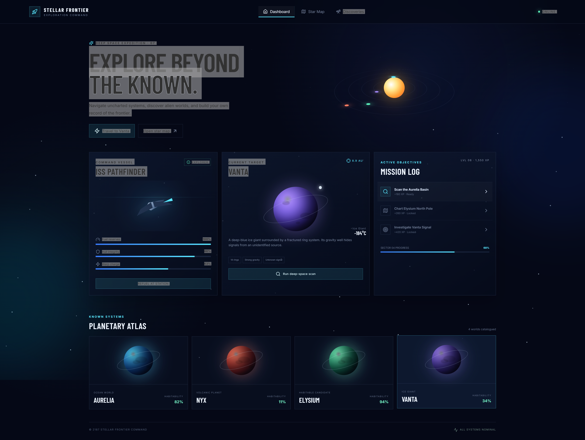

# 🚀 Stellar Frontier — Space Exploration Game


A cinematic **space exploration game interface** built with **React and Vite**. Explore distant planets, manage your spacecraft, complete missions, scan alien worlds, and navigate through an interactive star map.

The project combines a futuristic sci-fi interface with interactive game mechanics and responsive design.

---

## 📸 Screenshots

### 🌌 Main Dashboard



---

## ✨ Features

### 🚀 Space Exploration

* Travel between discovered planets
* Interactive exploration targets
* Spacecraft navigation system
* Fuel consumption during travel
* XP rewards for exploration

### 🪐 Planetary Atlas

Explore four unique worlds:

| Planet     | Type                | Distance | Habitability |
| ---------- | ------------------- | -------: | -----------: |
| 🌊 Aurelia | Ocean World         |   2.8 AU |          82% |
| 🌋 Nyx     | Volcanic Planet     |   4.1 AU |          11% |
| 🌱 Elysium | Habitable Candidate |   5.7 AU |          94% |
| ❄️ Vanta   | Ice Giant           |   8.9 AU |          34% |

Click any planet in the **Planetary Atlas** to make it your active exploration target.

---

## 🎯 Mission System

The game includes an interactive mission log with XP progression.

### Available Missions

* 🔭 Scan the Aurelia Basin
* 🗺️ Chart Elysium North Pole
* 📡 Investigate Vanta Signal

Completing exploration activities awards XP and progresses your expedition.

---

## ⛽ Spacecraft Management

The **ISS Pathfinder** dashboard provides real-time spacecraft statistics:

* Fuel reserves
* Hull integrity
* Warp charge
* Explorer status
* Refueling functionality

Fuel is consumed when traveling to another world, while scanning missions can affect hull integrity.

---

## 🔭 Deep-Space Scanner

Use the **Deep-Space Scan** feature to investigate your current target.

Successful scans:

* Generate XP
* Upload planetary data
* Progress your expedition
* Slightly affect spacecraft hull integrity

---

## 🗺️ Interactive Star Map

The **Star Map** provides a visual navigation interface for Sector 04.

From the map you can:

* View discovered worlds
* Select navigation targets
* Switch between planets
* Plan your next exploration destination

---

## 🌌 Visual Design

The interface is inspired by futuristic spacecraft command systems.

### Design Features

* Animated starfield
* Orbital planetary animations
* Sci-fi HUD components
* Glowing neon effects
* Glassmorphism-inspired panels
* Space-themed gradients
* Animated spacecraft
* Responsive planetary cards
* Interactive modal star map
* Dark space environment

---

## 📱 Responsive Design

The application is designed to work across:

* 💻 Desktop
* 💻 Laptop
* 📱 Tablet
* 📱 Mobile

The navigation, dashboard panels, planet cards, and star map adapt to smaller screen sizes.

---

## 🛠️ Tech Stack

### Frontend

* **React 18**
* **Vite**
* **JavaScript ES6+**
* **CSS3**

### Icons

* **Lucide React**

### Development

* Vite development server
* ES modules
* React functional components
* React Hooks

---

## 📂 Project Structure

```text
space-exploration-game/
│
├── screenshot.png
│
├── src/
│   ├── App.jsx
│   ├── main.jsx
│   └── styles.css
│
├── index.html
├── package.json
├── vite.config.js
└── README.md
```

---

## 🚀 Getting Started

### 1. Clone the repository

```bash
git clone https://github.com/ajinkya029/space-exploration-game.git
```

### 2. Navigate to the project

```bash
cd space-exploration-game
```

### 3. Install dependencies

```bash
npm install
```

### 4. Start the development server

```bash
npm run dev
```

Open the URL shown in your terminal, usually:

```text
http://localhost:5173
```

---

## 🏗️ Production Build

Create an optimized production build:

```bash
npm run build
```

Preview the production build locally:

```bash
npm run preview
```

---

## 🎮 How to Play

### Travel

Click:

```text
Travel to [Planet]
```

Travel consumes fuel and rewards exploration XP.

### Scan

Click:

```text
Run deep-space scan
```

to investigate the currently selected planet.

### Refuel

Use:

```text
REFUEL AT STATION
```

to restore your fuel reserves to 100%.

### Select a Planet

Click any planet in the **Planetary Atlas** to change your current target.

### Star Map

Open:

```text
Open Star Map
```

and select a planet directly from the navigation system.

---

## 🧠 React Concepts Demonstrated

This project demonstrates several practical React concepts:

* Functional components
* `useState`
* `useEffect`
* `useMemo`
* Component composition
* Dynamic rendering with `.map()`
* Conditional rendering
* Event handling
* Dynamic inline styles
* Reusable UI components
* Responsive UI design

---

## 🔮 Future Improvements

Possible future upgrades include:

- Persistent player progress
- Multiple star systems
- Procedurally generated planets
- Planet landing gameplay
- Resource mining
- Space combat
- Ship upgrades
- Inventory system
- Achievement system
- Save/load game functionality
- Sound effects and background music
- 3D planetary exploration
- Backend integration
- User authentication
- Global leaderboard

---

## 👨‍💻 Author

**Ajinkya Dhatrak**

Github : ```https://github.com/ajinkya029```

---

## ⭐ Support

If you like this project, consider giving the repository a ⭐ on GitHub.

---

## 📄 License

This project is available for educational and portfolio purposes.
